# Performance Analysis Summary

## Introduction
This summary presents the performance analysis of various tracefiles using different prefetching strategies. The analysis includes IPC, Speed Up, MPKI (Misses Per Kilo Instructions), and prefetcher accuracy for IP Stride and Stream prefetchers.

## IP Stride Prefetcher

A specialised piece of hardware called the IP Stride Prefetcher was created to improve memory access prediction using the instruction pointer (IP) as a major factor. It works by observing and forecasting a program's patterns of memory access. Tracking the "stride" of memory accesses, which is the distinction in memory locations between subsequent memory accesses, is the main approach it uses. Its mechanism of operation:

1. **Memory Access Entry Table:**
Each entry in the table that the prefetcher maintains contains the data listed below:
The address of the instruction that caused the memory access, or IP address.
Stride: For the relevant memory access, the estimated stride value.
2. **Predictive Mechanism:**
The IP Stride Prefetcher scans its entry table as the programme runs and instructions result in memory accesses.
To find the pertinent memory access patterns, it compares entries in the database with the current IP address.
The prefetcher starts a prefetch request for the following memory address based on the projected stride if it is confident in its prediction.
3. **Effectiveness and Limitations:**
When working with programmes that have predictable memory access patterns, the IP Stride Prefetcher performs quite well. This includes situations in which memory accesses take place successively or gradually (such as when accessing array elements).
However, when used with programmes that have erratic memory access patterns or randomly access memory regions, its usefulness is reduced. In these circumstances, the IP Stride Prefetcher might have trouble making correct forecasts, which would lead to modest performance gains.

### Normalized Speed Up
We observe the IPC or Intructions per Cycle (Cumulative) as a parameter to calculate the speedup and performance of the IP-Stride Prefetcher. The observed data is as following :

| Tracefile   | 602     | 603     | 619     | sssp-3    | bc-0    |
|-------------|---------|---------|---------|---------|---------|
| Degree 2| 0.436 | 0.497 | 0.209 | 0.328 | 0.147 |
| Degree 3| 0.473 | 0.605 | 0.211 | 0.329 | 0.147 |
| Degree 4| 0.502 | 0.743 | 0.210 | 0.329 | 0.147 |
| Degree 5| 0.526 | 0.794 | 0.210 | 0.330 | 0.147 |
|No Prefetcher| 0.320 | 0.352 | 0.212 | 0.288 | 0.137 |

Then we obtain the speedup due to the prefetcher compared to a baseline with no prefetching :

| TraceFile   | 602       | 603       | 619       | sssp      | bc-0      | Mean      |
|-------------|-----------|-----------|-----------|-----------|-----------|-----------|
| Degree 2| 1.362| 1.410| 0.985| 1.139| 1.076| 1.194|
| Degree 3| 1.478| 1.716| 0.995| 1.141| 1.075| 1.281|
| Degree 4| 1.568| 2.107| 0.990| 1.142| 1.073| 1.375|
| Degree 5| 1.643| 2.253| 0.993| 1.145| 1.073| 1.421|

We have the maximum normalised speedup across all tracefiles using IP-Stride degree 5. \
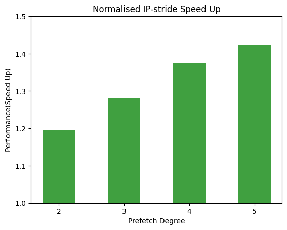
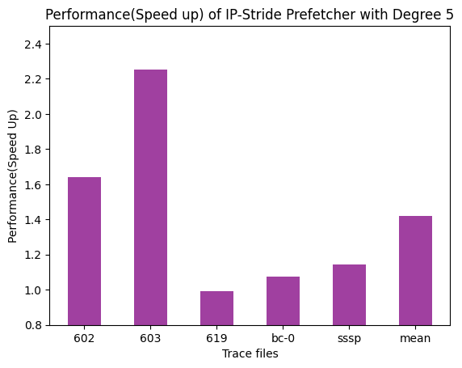

### L1D MPKI

|  With/Without Prefetcher  | 602       | 603       | 619       | sssp      |bc-0      | Mean  |
|-------------|-----------|-----------|-----------|-----------|-----------|-----------|
| With Prefetcher |24.10792 |20.01012 |78.02284 |83.46784 |49.68736|51.056|
| WithOut Prefetcher |24.10792 |20.01008 |78.02284 |83.46784 |49.68736|51.056|
<!--  -->

### L2C MPKI

|  With/Without Prefetcher  | 602       | 603       | 619       | sssp      |bc-0      | Mean  |
|-------------|-----------|-----------|-----------|-----------|-----------|-----------|
| With Prefetcher |17.8737 |19.00724 |48.4208 |44.11408 |82.36992|42.3571|
| WithOut Prefetcher |17.8032 |19.0094 |48.3794 |38.5616 |74.1712|39.585|

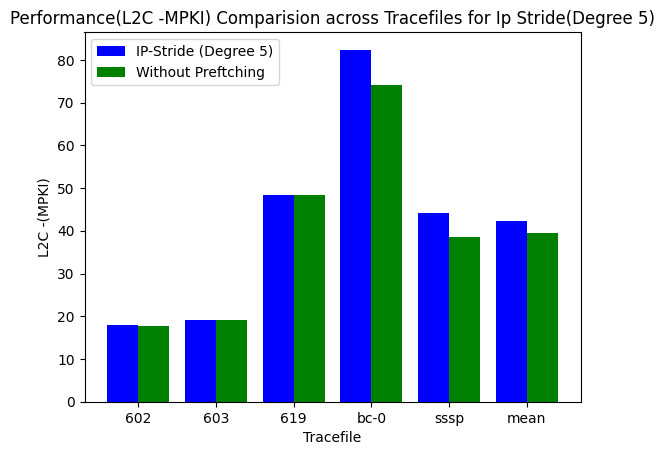

### Prefetcher Accuracy
|Tracefile | 602  | 603       | 619       | sssp      |bc-0      | Mean  |
|-----------|-----------|-----------|-----------|-----------|-----------|-----------|
| Accuracy(in %) |   99.69   |  100  |100|63.35|46.59|81.95|h|
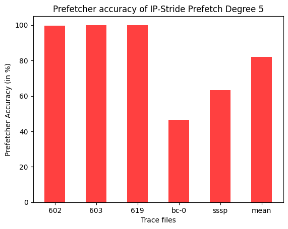

## Stream Prefetcher
Stream Prefetcher is a type of hardware prefetcher which predicts memory accesses based on the patterns observed in previous memory accesses. It accomplishes this by identifying streams of memory accesses, which are sequences of memory accesses made to consecutive memory locations. 

The Stream Prefetcher maintains an array with a size of 64, and each element in this array contains the following information:
1. **start_ptr**: The starting address of the monitored memory region. \
2. **end_ptr**: The ending address of the monitored memory region. \
3. **direction**: The direction of the stream (ascending or descending). \
4. **state**: The state of the tracker entry, which is explained below. \
5. **last_used_cycle**: The cycle when the stream was last used. This information is used to evict entries that have not been used for a long time. \

States of the Tracker Entry:

1. **Invalid:** 
In this state, the tracking entry is not associated with any stream. Initially, all tracking entries start in this state. \
2. **Allocated:** 
When a demand L2 cache miss occurs and there is no existing tracking entry for the cache-block address, the tracking entry is allocated for this miss. \
3. **Training:** The prefetcher enters this state to train the direction (ascending or descending) of the stream. It does so based on the next two L2 cache misses that occur within +/- 16 cache blocks from the location of the first miss. If the next two accesses are to ascending addresses, the direction of the tracking entry is set to 1; otherwise, it's set to 0. The entry then transitions to the "Monitor and Request" state. \
4. **Monitor and Request:** In this state, the tracking entry monitors memory accesses to a specific memory region defined by a start pointer (address A) and an end pointer (address P). The maximum distance between A and P is determined by the Prefetch Distance, indicating how far ahead of the demand access stream the prefetcher can send requests. When a demand L2 cache access is made to a cache block within the monitored memory region, the prefetcher issues prefetch requests for cache blocks [P+1, ..., P+N], assuming that the direction of the tracking entry is set to 1. Here, N represents the Prefetch Degree. After issuing prefetch requests, the tracking entry shifts its monitoring to the memory region between addresses A+N and P+N, effectively moving the monitored region by N cache blocks.

### Normalized Speed Up
We observe the IPC or Intructions per Cycle (Cumulative) as a parameter to calculate the speedup and performance of the IP-Stride Prefetcher. The observed data is as following :

The IPC obtained by using stream prefetcher is as following:

| TraceFile   | 602      | 603      | I619     | sssp     | bc-0     |
|-------------|----------|----------|----------|----------|----------|
|(Degree:2, Distance :3)| 0.628212 | 0.484624 | 0.218332 | 0.337481 | 0.14812  |
|(Degree:2, Distance :4)| 0.61663  | 0.504065 | 0.218103 | 0.335931 | 0.147594 |
|(Degree:3, Distance :3)| 0.631707 | 0.507711 | 0.219833 | 0.339306 | 0.14824  |
|(Degree:3, Distance :4) | 0.616866 | 0.647549 | 0.216853 | 0.334211 | 0.147421 |
|(Degree:5, Distance :3) | 0.637715 | 0.67787  | 0.222589 | 0.338811 | 0.14838  |
|No Prefetcher| 0.32092  | 0.35270 | 0.21217 | 0.28876 | 0.13701 |

Then we obtain the speedup due to the prefetcher compared to a baseline with no prefetching :

| TraceFile              | 602       | 603       | 619       | sssp      | bc-0      | Mean      |
|------------------------|-----------|-----------|-----------|-----------|-----------|-----------|
| (Degree:2, Distance:3) | 1.957| 1.374| 1.029 | 1.168| 1.081| 1.322
| (Degree:2, Distance:4) | 1.921| 1.429| 1.0279| 1.163| 1.077| 1.323|
| (Degree:3, Distance:3) | 1.968| 1.439| 1.036| 1.175| 1.081| 1.567|
| (Degree:3, Distance:4) | 1.922| 1.8359| 1.022| 1.157 | 1.075| 1.642|
| (Degree:5, Distance:3) | 1.9871| 1.921 | 1.049| 1.173| 1.082| 1.691|

We obtain the maximum normalised speedup across all tracefiles using Stream Prefetcher degree 5 ,distance 3. \
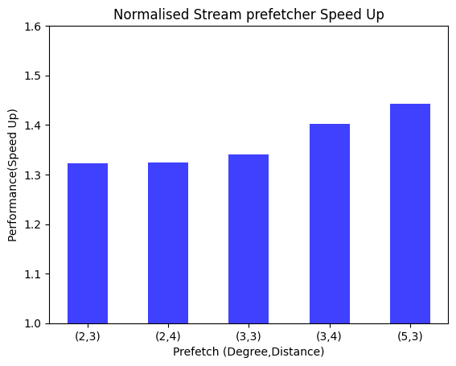
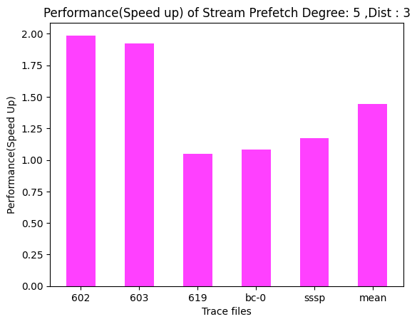

### L1D MPKI

|  With/Without Prefetcher  | 602       | 603       | 619       | sssp      |bc-0      | Mean  |
|-------------|-----------|-----------|-----------|-----------|-----------|-----------|
| With Prefetcher |24.10792 |20.01008 |78.02284 |83.46784 |49.68736|51.056|
| WithOut Prefetcher |24.10792 |20.01008 |78.02284 |83.46784 |49.68736|51.056|
<!--  -->

### L2C MPKI

|  With/Without Prefetcher  | 602       | 603       | 619       | sssp      |bc-0      | Mean  |
|-------------|-----------|-----------|-----------|-----------|-----------|-----------|
| With Prefetcher | 19.3892 | 19.8049 |48.8672|75.6752|40.9342|41.3507|
| WithOut Prefetcher |17.803 | 19.009 | 48.379| 74.171 |38.561|39.585|

### Prefetcher Accuracy
|Tracefile | 602  | 603       | 619       | bc-0      |sssp     | Mean  |
|-----------|-----------|-----------|-----------|-----------|-----------|-----------|
| Accuracy(in %) | 92.055  |  93.1359  |94.058|73.953|75.483|85.737|

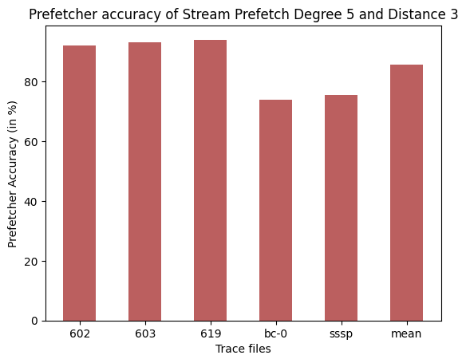

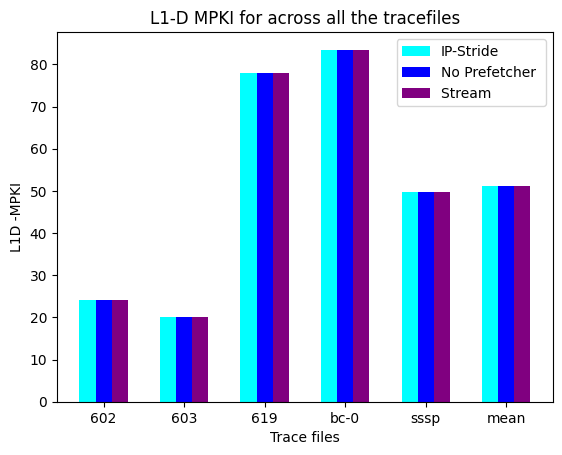

## Throttling
### IP Stride Throttling Prefetcher
The IP Stride Throttling Prefetcher bears resemblance to the IP Stride Prefetcher but introduces a dynamic throttling approach for regulating the number of prefetch requests generated. This regulation is achieved through the monitoring of an accuracy counter. The accuracy counter is used to make real-time decisions about when and how many prefetch requests to issue. It helps maintain the optimal balance between prefetching and not overloading the memory system.

We obtained the following speedup using IP Stride Throttling :
| TraceFile   | 602       | 603       | 619       | sssp      | bc-0      | Mean      |
|-------------|-----------|-----------|-----------|-----------|-----------|-----------|
| Speedup | 1.56487111 |2.10760642| 0.99047457 |1.07561381| 1.14623858 |1.3769609|

### Stream Throttling Prefetcher
The Stream Throttling Prefetcher shares similarities with the Stream Prefetcher but employs a throttling mechanism to dynamically manage the prefetch distance and degree. Similar to the IP Stride Throttling Prefetcher, it relies on a running accuracy counter for control. The accuracy counter continually adjusts the prefetching behavior of the Stream Throttling Prefetcher based on real-time observations. This ensures that the prefetcher doesn't overwhelm the memory system with excessive requests and maintains efficiency.

We obtained the following IPC and speedup using IP Stride Throttling :
| TraceFile   | 602       | 603       | 619       | sssp      | bc-0      | Mean      |
|-------------|-----------|-----------|-----------|-----------|-----------|-----------|
| Speedup |1.95641295 |1.43950134| 1.00963383 |1.08026304| 1.16830181 |1.33082259|

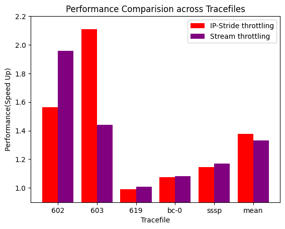

## Overall Performance Comparison

### Performance Comparision
- IP Stride vs. Stream vs. Throttling \
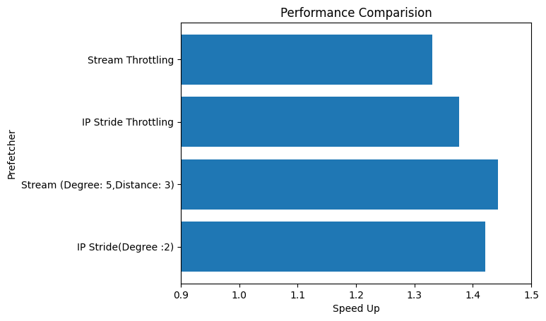

## Conclusion
In conclusion, the analysis provides insights into the performance of IP Stride and Stream prefetchers across various tracefiles. It also highlights the impact of throttling and prefetcher accuracy on performance metrics.

## Bonus Task: Stride + Stream Prefetcher

We observe the IPC as a parameter to calculate the speedup of the Stride + Stream combiational Prefetcher. The observed data is as following :

The IPC obtained by using stream prefetcher is as following:

| TraceFile   | 602      | 603      | 619     | sssp-3     | bc-0     |
|-------------|----------|----------|----------|----------|----------|
|(Degree:2, Distance :3)| 0.321 | 0.353 | 0.212 | 0.288 | 0.137  |
|(Degree:2, Distance :4)| 0.609  | 0.501 | 0.212 | 0.334 | 0.147 |
|(Degree:3, Distance :3)| 0.321 | 0.353 | 0.212 | 0.288 | 0.137  |
|(Degree:3, Distance :4) | 0.616 | 0.503 | 0.212| 0.335 | 0.147 |
|No Prefetcher| 0.321  | 0.353 | 0.212 | 0.288 | 0.137 |

Then we obtain the speedup due to the prefetcher compared to a baseline with no prefetching :

| TraceFile              | 602       | 603       | 619       | sssp      | bc-0      | Mean      |
|------------------------|-----------|-----------|-----------|-----------|-----------|-----------|
| (Degree:2, Distance:3) | 1.000 | 1.665 | 0.736 | 2.102 | 1.000 | 1.301 |
| (Degree:2, Distance:4) | 1.897 | 1.363 | 0.736 | 2.438 | 1.073 | 1.501 |
| (Degree:3, Distance:3) | 1.000 | 1.665 | 0.736 | 2.102 | 1.000 | 1.301 |
| (Degree:3, Distance:4) | 1.919 | 2.372 | 0.736 | 2.445 | 1.073 | 1.709 |

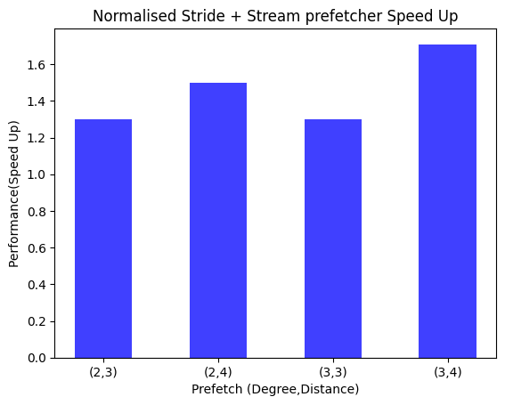